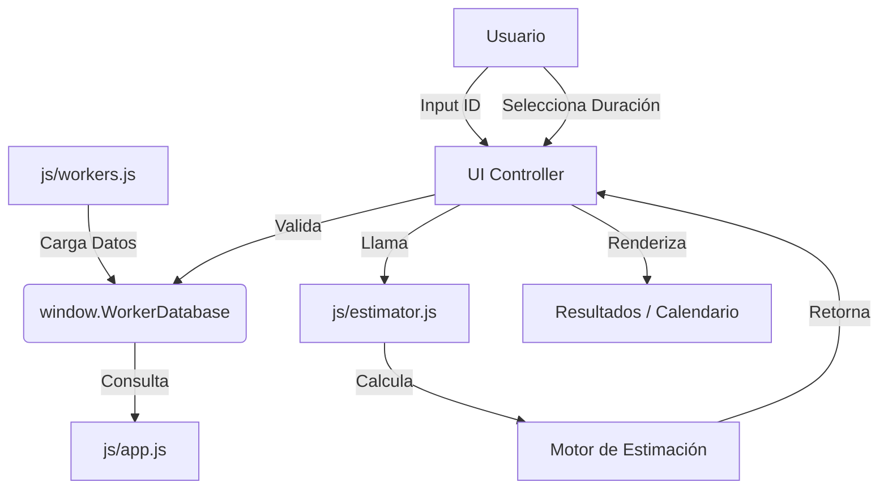

# 🔎 Análisis Técnico: Calculadora de Estimación "Aurora"

## 1. Visión General del Proyecto
La **Calculadora de Estimación Aurora** es una aplicación web *Single Page Application* (SPA) diseñada para estimar fechas de finalización de tareas basándose en la disponibilidad real de los trabajadores. Su enfoque principal es la simplicidad ("zero-config"), la estética moderna ("Aurora Bento UI") y la filosofía *Mobile-First*.

## 2. Arquitectura del Sistema

El proyecto sigue una arquitectura monolítica de cliente (frontend-only) sin dependencias de compilación.

*   **Pila Tecnológica**:
    *   **Core**: HTML5 Semántico + Javascript (ES6+).
    *   **Estilos**: Tailwind CSS (vía CDN) + CSS Custom Properties para animaciones.
    *   **Datos**: Almacenamiento local en memoria (`workers.js`).
    *   **Gestión de Estado**: Objeto `state` reactivo simple en `app.js`.

### Diagrama de Flujo (Simplificado)

## 3. Análisis de Componentes

### 3.1. Gestión de Datos (`js/workers.js`)
*   **Función**: Actúa como una base de datos simulada.
*   **Estructura**: Define un objeto global `window.WorkerDatabase`.
*   **Segregación**: La reciente extracción de este archivo desde `app.js` mejora significativamente la mantenibilidad, permitiendo editar trabajadores sin tocar la lógica.
*   **Contenido**: Cada trabajador tiene ID, nombre, rol, avatar, y un objeto `schedule` complejo (días laborales, horas de turno, festivos).

### 3.2. Lógica de Negocio (`js/estimator.js`)
*   **Motor de Tiempo**: La lógica ha sido extraída a un módulo puro `AuroraEstimator`.
    *   Maneja saltos de día (`jumpToNextShift`).
    *   Considera horarios de inicio/fin de turno.
    *   Tiene en cuenta array de `holidays` (festivos).
*   **Algoritmo**: Utiliza un bucle `while` que consume minutos de la tarea contra el tiempo disponible en el turno actual.

### 3.3. Controlador de UI (`js/app.js`)
*   **Diseño**: Implementa un patrón "Bento Grid" (rejilla modular).
*   **Feedback**: Uso extensivo de micro-interacciones (validación con "shake", transiciones de opacidad, estados de carga).
*   **Responsabilidad**: Ahora se dedica exclusivamente a la gestión de la interfaz y delega los cálculos a `estimator.js`.

### 3.4. Interfaz (`index.html`)
*   **Estética**: Uso avanzado de Tailwind para efectos de vidrio (*glassmorphism*), sombras y gradientes.
*   **Animaciones**: Animaciones CSS personalizadas para las nubes de fondo y transiciones de elementos.

## 4. Puntos Fuertes
1.  **Simplicidad de Despliegue**: Al ser estático puro, puede hospedarse en cualquier lugar (GitHub Pages, Netlify, carpeta local).
2.  **Experiencia de Usuario (UX)**: El diseño visual es superior al estándar de "herramientas internas", lo que favorece su adopción.
3.  **Modularidad Incipiente**: La separación de `workers.js` es un buen primer paso hacia una arquitectura más limpia.

## 5. Áreas de Mejora / Deuda Técnica

### A. Gestión de Dependencias
*   **Riesgo**: Dependencia de CDN para Tailwind. Si no hay internet, la app pierde el estilo.
*   **Recomendación**: Considerar una build step simple o descargar el CSS si se requiere uso offline estricto.

### B. Escalabilidad de Datos
*   **Riesgo**: `workers.js` carga todos los trabajadores en memoria. Si la empresa crece a 1000 empleados, esto podría ser ineficiente.
*   **Mejora**: Carga asíncrona (`fetch`) de un JSON real en lugar de un JS global.

### C. Lógica de Fechas
*   **Riesgo**: El manejo de fechas nativo de JS (`Date`) es propenso a errores de zona horaria (UTC vs Local).
*   **Mejora**: Asegurar que todas las comparaciones normalicen zonas horarias o usar librerías ligeras como `date-fns` si la complejidad aumenta.

### D. Mantenimiento del Código UI
*   **Estado**: ✅ RESUELTO
*   **Mejora Aplicada**: Se ha separado la lógica de cálculo en `js/estimator.js`, dejando `js/app.js` limpio y centrado solo en la interfaz.

## 6. Conclusión
El proyecto es una herramienta sólida y bien diseñada para su propósito actual. La base de código es limpia y legible. La arquitectura es adecuada para el alcance actual, con margen claro para evolucionar hacia una PWA o una app más compleja si fuera necesario.
